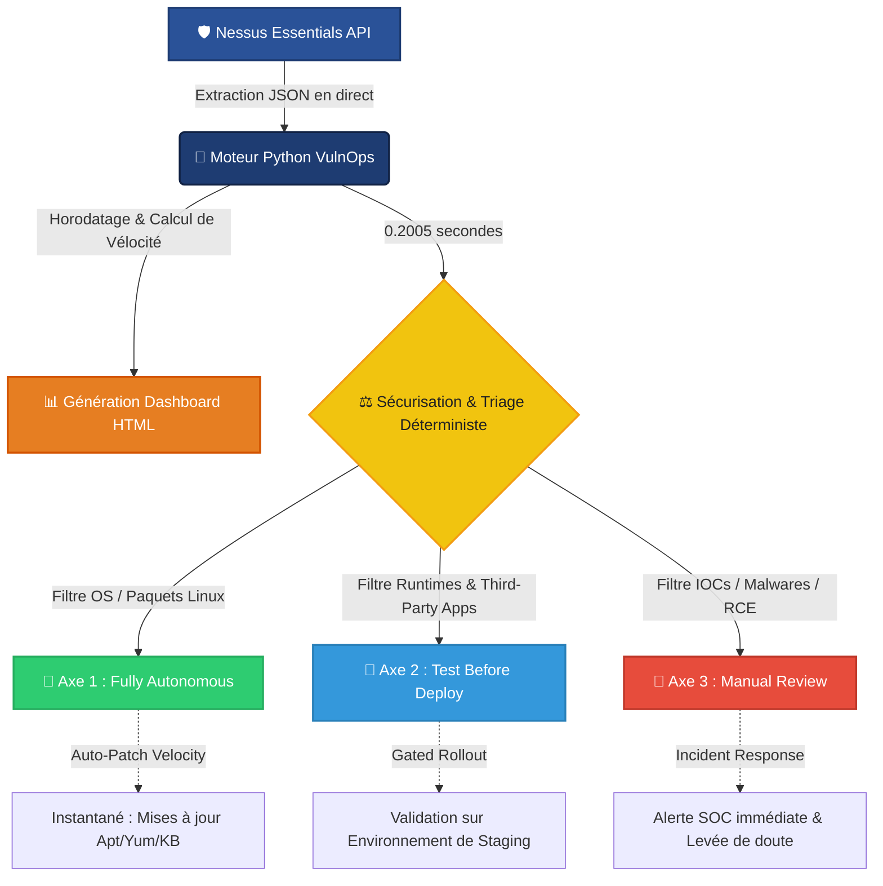

<h1 align="center">🛡️ VulnOps-Scale: Enterprise Patch Velocity Framework for automated vulnerability remediation & software lifecycle governance</h1>


## 📌 Introduction

Ce projet implémente un framework d'automatisation et de gouvernance déterministe conçu pour éliminer la latence opérationnelle entre la détection d'une vulnérabilité et sa remédiation. 

En s'appuyant directement sur l'API de **Tenable Nessus**, ce moteur convertit des rapports de scan en métriques de performance stratégiques (**Patch Velocity**) et oriente les menaces à la vitesse de la machine.

## 🎯 Objectifs du Projet

- 🔄 **Automatisation API :** Interroger Nessus Essentials en direct sans intervention humaine
- 📊 **Calcul de la Patch Velocity :** Mesurer le temps d'arbitrage (en millisecondes) et le volume de traitement
- ⚡ **Taux d'Absorption :** Isoler 100% des vulnérabilités d'OS éligibles à un auto-patching immédiat

## 🏗️ Technical Stack

- **Vulnerability Management :** Tenable Nessus Essentials
- **Orchestrateur & Triage :** Python 3 (Requests, Dotenv)
- **Environnement de Contrôle :** Debian 
- **Environnements évalués :** Linux & Windows


## 🏗️ Architecture du Pipeline VulnOps-Scale



## 🛠️ Installation & Configuration
1. Clonez le dépôt.
2. Créez un fichier `.env` à la racine avec vos clés API Nessus :
   ```env
   NESSUS_ACCESS_KEY=votre_cle
   NESSUS_SECRET_KEY=votre_cle
   NESSUS_URL=https://localhost:8834
   ```
3. Lancez l'orchestrateur : `python3 vulnOps_automator.py

## 🔍 Preuve de Concept & Résultats 


### 🔹 Évaluation de l'Infrastructure  (`Lin-01`)
Lors de l'exécution du pipeline sur notre infrastructure en production, le framework a généré les métriques de vélocité suivantes :


### 🔹RESULTAT RESULTAT RESULTAT 

<svg xmlns="http://w3.org" viewBox="0 0 900 450" width="100%" style="background:#0f141c; border-radius:12px; font-family:system-ui,-apple-system,sans-serif;">
  <defs>
    <!-- Filtre Néon / Glow intense -->
    <filter id="cyber-glow" x="-20%" y="-20%" width="140%" height="140%">
      <feGaussianBlur stdDeviation="8" result="blur" />
      <feMerge>
        <feMergeNode in="blur" />
        <feMergeNode in="SourceGraphic" />
      </feMerge>
    </filter>
    <!-- Dégradé sous la courbe -->
    <linearGradient id="green-fade" x1="0" y1="0" x2="0" y2="1">
      <stop offset="0%" stop-color="#00ff66" stop-opacity="0.25"/>
      <stop offset="100%" stop-color="#00ff66" stop-opacity="0.00"/>
    </linearGradient>
  </defs>

  <!-- Styles CSS pour l'interactivité au survol -->
  <style>
    .interactive-point { transition: transform 0.2s ease, r 0.2s ease; cursor: pointer; }
    .interactive-point:hover { transform: scale(1.5); r: 8px; fill: #ffffff !important; }
    .grid-line { stroke: #1b2330; stroke-width: 1; }
    .text-title { fill: #ffffff; font-size: 18px; font-weight: bold; letter-spacing: 0.5px; }
    .text-muted { fill: #768390; font-size: 13px; }
    .text-green { fill: #00ff66; font-size: 18px; font-weight: bold; }
    .data-box { fill: #161d29; stroke: #222c3e; stroke-width: 1; rx: 8px; }
    .interactive-row { transition: opacity 0.2s; cursor: pointer; }
    .interactive-row:hover { opacity: 0.7; }
  </style>

  <!-- En-tête -->
  <text x="50" y="50" class="text-title">SECURITY TREND</text>
  <text x="850" y="50" class="text-green" text-anchor="end">MITIGATION: 100% ▲</text>
  <text x="850" y="75" fill="#768390" font-size="13" text-anchor="end">Lin-01 Secured</text>

  <!-- Grille horizontale (0, 4, 8, 12, 16) -->
  <g>
    <line x1="100" y1="120" x2="650" y2="120" class="grid-line" />
    <line x1="100" y1="185" x2="650" y2="185" class="grid-line" />
    <line x1="100" y1="250" x2="650" y2="250" class="grid-line" />
    <line x1="100" y1="315" x2="650" y2="315" class="grid-line" />
    <line x1="100" y1="380" x2="650" y2="380" class="grid-line" />
  </g>

  <!-- Échelle Y (Valeurs) -->
  <g class="text-muted" text-anchor="end">
    <text x="80" y="124">16</text>
    <text x="80" y="189">12</text>
    <text x="80" y="254">8</text>
    <text x="80" y="319">4</text>
    <text x="80" y="384">0</text>
  </g>

  <!-- Zone de remplissage dégradée sous le graphique -->
  <path d="M 100 120 C 250 220, 350 380, 500 380 L 650 380 L 650 380 L 100 380 Z" fill="url(#green-fade)" />

  <!-- Ligne Courbe Néon Interactive -->
  <path d="M 100 120 C 250 220, 350 380, 500 380 L 650 380" fill="none" stroke="#00ff66" stroke-width="4" filter="url(#cyber-glow)" stroke-linecap="round" />

  <!-- Points Interactifs (Hover pour effet lumineux) -->
  <circle cx="100" cy="120" r="5" fill="#00ff66" class="interactive-point" filter="url(#cyber-glow)" />
  <circle cx="650" cy="380" r="6" fill="#ffffff" class="interactive-point" filter="url(#cyber-glow)" style="transform-origin: 650px 380px;" />

  <!-- Libellés de l'Axe X -->
  <text x="100" y="415" class="text-muted" text-anchor="middle">SCAN 1 (Initial: 16 Vulns)</text>
  <text x="400" y="415" class="text-muted" text-anchor="middle">SCAN 2 (Post-Patch: 1 Low)</text>
  <text x="650" y="415" class="text-muted" text-anchor="middle">SCAN 3</text>

  <!-- Panneau de données latéral (SUMMARY DATAS) -->
  <g transform="translate(680, 120)">
    <rect width="170" height="180" class="data-box" />
    <text x="15" y="25" fill="#ffffff" font-size="12" font-weight="bold" letter-spacing="0.5">SUMMARY DATAS</text>
    
    <!-- Lignes de métriques interactives au survol -->
    <g class="interactive-row" transform="translate(0, 50)">
      <text x="15" y="0" class="text-muted">Critical:</text>
      <text x="155" y="0" fill="#ffffff" font-weight="bold" text-anchor="end">0</text>
    </g>
    <g class="interactive-row" transform="translate(0, 75)">
      <text x="15" y="0" class="text-muted">High:</text>
      <text x="155" y="0" fill="#ffffff" font-weight="bold" text-anchor="end">0</text>
    </g>
    <g class="interactive-row" transform="translate(0, 100)">
      <text x="15" y="0" class="text-muted">Medium:</text>
      <text x="155" y="0" fill="#ffffff" font-weight="bold" text-anchor="end">0</text>
    </g>
    <g class="interactive-row" transform="translate(0, 124)">
      <text x="15" y="0" class="text-muted">Low:</text>
      <text x="155" y="0" fill="#00ff66" font-weight="bold" text-anchor="end">1</text>
    </g>
    <g class="interactive-row" transform="translate(0, 150)">
      <text x="15" y="0" class="text-muted">Info:</text>
      <text x="155" y="0" fill="#0077ff" font-weight="bold" text-anchor="end">12</text>
    </g>
  </g>

  <!-- Note de bas de page -->
  <text x="850" y="415" class="text-muted" font-size="11" text-anchor="end">Total Mitigated: 100%</text>
</svg>


## 📖 Documentation

L'intelligence algorithmique et la logique de triage de ce framework s'appuient sur les standards et référentiels de sécurité suivants :

- **[Tenable Nessus API Documentation](https://tenable.com)** 
- **[CISA KEV (Known Exploited Vulnerabilities)](https://cisa.gov)** 
- **[FIRST CVSS v3.1/v4.0 Framework](https://first.org)** 
- **[FIRST EPSS (Exploit Prediction Scoring System)](https://first.org)** 
- **[MITRE ATT&CK Framework](https://mitre.org)** 


<p align="center">
  🛡️ <strong>Hubert Codjo</strong><br>
  <sub>Cybersecurity Engineer • Vulnerability Analyst • </sub><br><br>
  📧 <a href="mailto:houet.hubert@gmail.com"><strong>Click to contact me</strong></a><br><br>
  ─ · ─<br><br>
</p>