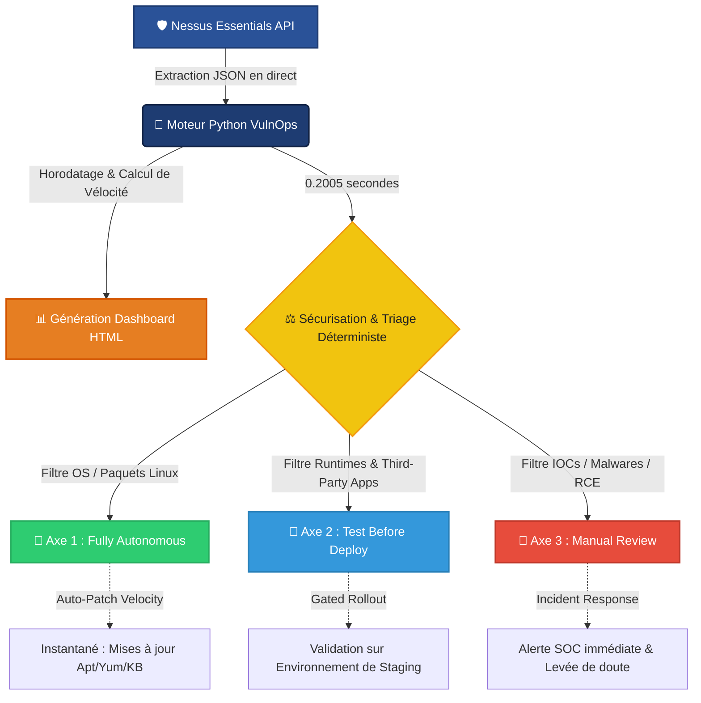

<h1 align="center">🛡️ VulnOps-Scale: Enterprise Patch Velocity Framework for automated vulnerability remediation & software lifecycle governance</h1>


## 📌 Introduction

Ce projet implémente un framework d'automatisation et de gouvernance déterministe conçu pour éliminer la latence opérationnelle entre la détection d'une vulnérabilité et sa remédiation. 

En s'appuyant directement sur l'API de **Tenable Nessus**, ce moteur convertit des rapports de scan en métriques de performance stratégiques (**Patch Velocity**) et oriente les menaces à la vitesse de la machine.

## 🎯 Objectifs du Projet

- 🔄 **Automatisation API :** Interroger Nessus Essentials en direct sans intervention humaine.
- 📊 **Calcul de la Patch Velocity :** Mesurer le temps d'arbitrage (en millisecondes) et le volume de traitement.
- ⚡ **Taux d'Absorption :** Isoler 100% des vulnérabilités d'OS éligibles à un auto-patching immédiat.

## 🏗️ Technical Stack

- **Vulnerability Management :** Tenable Nessus Essentials
- **Orchestrateur & Triage :** Python 3 (Requests, Dotenv)
- **Environnement de Contrôle :** Debian Linux
- **Cibles Évaluées :** Linux (Lin-01) & Windows (WIN-01)

## 🔗 Architecture du Pipeline

## 🏗️ Architecture du Pipeline VulnOps-Scale




## 🔍 Preuve de Concept & Résultats (Données Réelles)

### 🔹 Évaluation de l'Infrastructure Linux (`Lin-01`)
Lors de l'exécution du pipeline sur notre infrastructure Linux réelle, le framework a généré les métriques de vélocité suivantes :

- 🔴 **Vulnérabilités critiques totales :** 13
- 🟢 **Failles éligibles à l'auto-patching (Axe 1) :** 13
- 📊 **Taux d'absorption automatisé :** 100.0 %
- ⏱️ **Vitesse de prise de décision :** 0.2005 secondes

### 🔹 Capture du Tableau de Bord Visuel
*(Mets ici une capture d'écran de ton fichier `vulnops_dashboard.html` une fois ouvert sur ton navigateur)*
``

## 🛠️ Installation & Configuration
1. Clonez le dépôt.
2. Créez un fichier `.env` à la racine avec vos clés API Nessus :
   ```env
   NESSUS_ACCESS_KEY=votre_cle
   NESSUS_SECRET_KEY=votre_cle
   NESSUS_URL=https://localhost:8834
   ```
3. Lancez l'orchestrateur : `python3 vulnOps_automator.py`


## 📖 Documentation

L'intelligence algorithmique et la logique de triage de ce framework s'appuient sur les standards et référentiels de sécurité internationaux suivants :

- **[Tenable Nessus API Documentation](https://tenable.com)** : Spécifications techniques des endpoints d'extraction des vulnérabilités en direct de la mémoire flash.
- **[CISA KEV (Known Exploited Vulnerabilities)](https://cisa.gov)** : Base de connaissances utilisée pour isoler les failles activement exploitées dans la nature (Axe 3 - Incident Response).
- **[FIRST CVSS v3.1/v4.0 Framework](https://first.org)** : Compréhension du calcul de sévérité environnementale et de la métrique brute de criticité.
- **[FIRST EPSS (Exploit Prediction Scoring System)](https://first.org)** : Modèle de données centré sur la probabilité d'exploitation réelle, à la base de la philosophie de la *Patch Velocity*.
- **[MITRE ATT&CK Framework](https://mitre.org)** : Cartographie des tactiques et techniques adverses utilisées pour qualifier les détections de malwares de l'Axe 3.


<p align="center">
  🛡️ <strong>Hubert Codjo</strong><br>
  <sub>Cybersecurity Engineer • Vulnerability Analyst • </sub><br><br>
  📧 <a href="mailto:houet.hubert@gmail.com"><strong>Click to contact me</strong></a><br><br>
  ─ · ─<br><br>
</p>